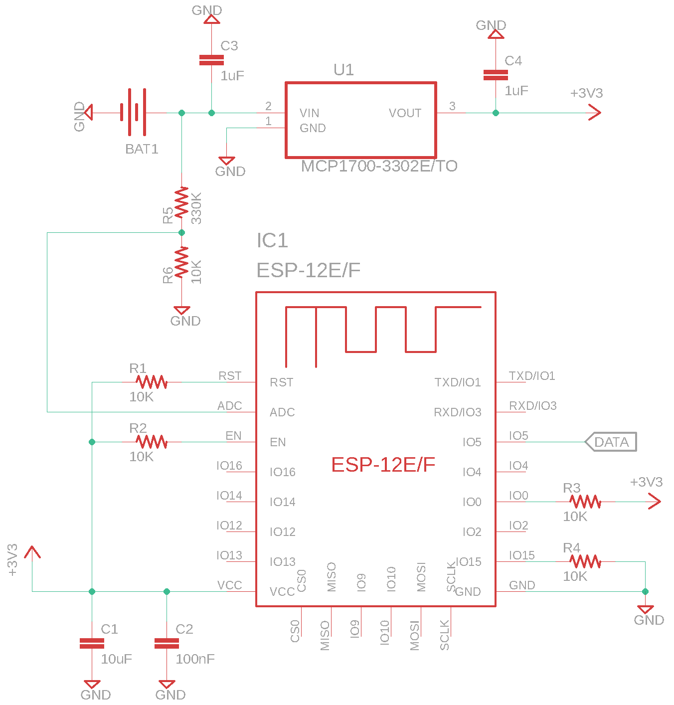
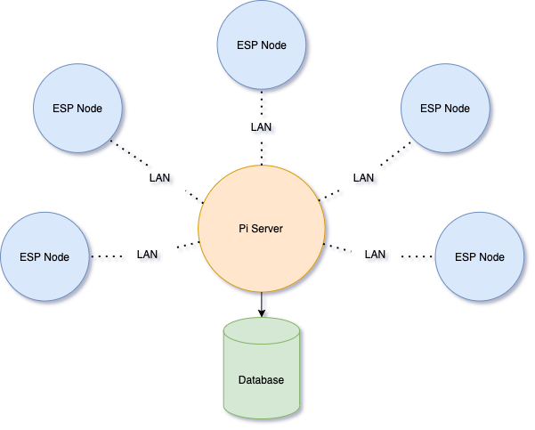
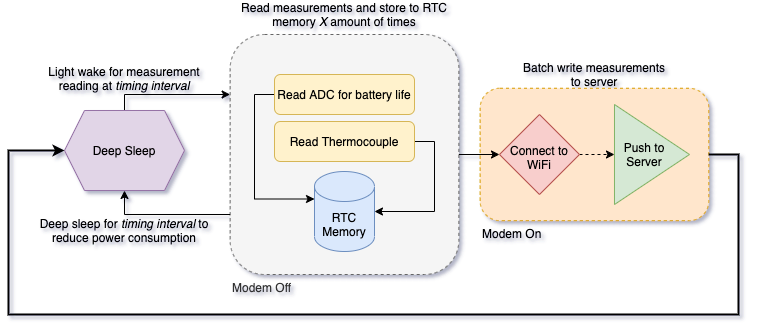

# Lab Monitoring IOT system

This project is designed to be used as a low cost IOT solution for monitoring laboratory environments and processes. It was originally developed for the central monitoring of -80&deg;C lab freezers to ensure stored sample viability. This project can easily be extended for the monitoring of additional variables.

-   [TODO](#todo)
    -   [Server](#server)
    -   [ESP Nodes](#esp-nodes)
-   [Setup](#setup)
    -   [Node Setup](#node-setup)
    -   [Server Setup](#server-setup)
-   [Current stack](#current-stack)
    -   [Hardware](#hardware)
        -   [Server](#server)
        -   [Nodes](#nodes)
    -   [Software](#software)
        -   [Server](#server)
        -   [Nodes](#nodes)
-   [Overview](#overview)
    -   [Parts List](#parts-list)
        -   [Nodes](#nodes)
    -   [Node wiring Schematic](#node-wiring-schematic)
    -   [Network Diagram](#network-diagram)
    -   [Node Software Flow Diagram](#node-software-flow-diagram)

## TODO

#### Server

-   [ ] Raspberry pi setup procedure/script
-   [ ] Stack installation procedure/script
    -   [ ] Setup Docker container ([IOT stack project](https://github.com/SensorsIot/IOTstack) may cover this if used)
-   [ ] Detail security hardening procedure

#### ESP Nodes

Software

-   [ ] [OTA Updates](https://arduino-esp8266.readthedocs.io/en/latest/ota_updates/readme.html)
-   [ ] Deep sleep between measurements for nodes
-   [ ] Batch write to Influx and store during deep sleep
-   [ ] Read battery level through analog input see [here](http://esp8266-projects.org/2015/03/internal-adc-esp8266/)

Hardware

-   [ ] Measure current consumption for accurate battery life estimation
-   [ ] Complete CAD modeling of case for nodes

## Setup

#### Node Setup

1. Flash software to ESP using programmer tool. **Be sure to include OTA updates in software as USB programming will be unavailable after assembly in current design.**
2. Assemble hardware as shown in [Node wiring Schematic](#node-wiring-schematic)
3. Configure WiFi using [WiFiManager](https://github.com/tzapu/WiFiManager)
4. Verify assembly and deploy

#### Server Setup

1. Flash OS and configure for boot from SSD
2. Install needed software (see [server software](#server))
3. Configure software
    1. InfluxDB
        1. Database creation
        2. Privileges
        3. Retention policy/Downsampling
    2. Grafana
        1. Privileges
        2. Alerts
4. Harden security
5. Verify and deploy

## Current stack

### Hardware

#### Server

-   Raspberry Pi
    -   SSD for storage
        -   If using Pi 4 be sure to use proper heat sink such as [Flirc](https://www.adafruit.com/product/4553)

#### Nodes

-   [ESP8266](https://arduino-esp8266.readthedocs.io/en/latest/index.html) - [ESP-12f](https://docs.ai-thinker.com/_media/esp8266/docs/esp-12f_product_specification_en.pdf) board
    -   [MAX31850K](https://learn.adafruit.com/adafruit-1-wire-thermocouple-amplifier-max31850k/wiring-and-test)
-   18650 LiPo Batteries
-   [MCP1700](https://www.digikey.com/product-detail/en/microchip-technology/MCP1700-3302E-TO/MCP1700-3302E-TO-ND/652680) IC REG LINEAR 3.3V 250MA

### Software

#### Server

-   Python 3
-   [IOT stack project](https://github.com/SensorsIot/IOTstack)
    -   [InfluxDB](https://www.influxdata.com/products/influxdb-overview/)
        -   Time series database used to store data measurements
    -   [Grafana](https://grafana.com/grafana/)
        -   Used for visualization of live data, and adjustable time period visualization

#### Nodes

-   C/C++
    -   Written using [PlatformIO](https://docs.platformio.org/en/latest/platforms/espressif8266.html)
-   Libraries
    -   [InfluxDB Arduino Client](https://github.com/tobiasschuerg/InfluxDB-Client-for-Arduino)
    -   OneWire
    -   DallasTemperature
    -   [WiFiManager](https://github.com/tzapu/WiFiManager)

## Overview

### Parts List

#### Nodes

**Note:** Resistors and capacitors not included. See [Node Wiring Schematic](#node-wiring-schematic) for additional components required.

| Name                                                                           | Link                                                                                                                  | Price     | Quantity |
| ------------------------------------------------------------------------------ | --------------------------------------------------------------------------------------------------------------------- | --------- | -------- |
| K-type Thermocouple                                                            | [Amazon](https://www.amazon.com/gp/product/B00OLNZ6XI/ref=ppx_yo_dt_b_asin_title_o06_s00?ie=UTF8&psc=1)               | \$13.80ea | 1        |
| ESP-12F WiFi Serial Module Microcontroller 802.11N Module Wireless Transceiver | [Amazon](https://www.amazon.com/gp/product/B07SDMHYY8/ref=ppx_yo_dt_b_asin_title_o00_s00?ie=UTF8&psc=1)               | \$2.20ea  | 1        |
| Programmer Tool ESP8266 Adapter Socket for ESPRESSIF ESP-12S ESP-07S Module    | [Amazon](https://www.amazon.com/gp/product/B07Z7PMJHV/ref=ppx_yo_dt_b_asin_title_o00_s01?ie=UTF8&psc=1)               | \$25.99   | 1        |
| Thermocouple Amplifier MAX31850K                                               | [Adafruit](https://www.adafruit.com/product/1727)                                                                     | \$14.95   | 1        |
| MCP1700-3302E/TO Low Dropout Linear Regulator 3.3V out                         | [Digikey](https://www.digikey.com/product-detail/en/microchip-technology/MCP1700-3302E-TO/MCP1700-3302E-TO-ND/652680) | \$0.37    | 1        |
| 18650 3400mAh LI-ION Battery                                                   | [Orbtronic](https://www.orbtronic.com/protected-3400mah-18650-li-ion-battery-panasonic-ncr18650B-orbtronic)           | \$12.99   | 1        |
| BATTERY HOLDER 18650                                                           | [Digikey](https://www.digikey.com/product-detail/en/keystone-electronics/1043P/36-1043P-ND/4499388)                   | \$2.94    | 1        |

### Node wiring Schematic

### Network Diagram

The Raspberry Pi acts as the central server, and is assigned a static IP for ease of connection. The server may be connected to the LAN (Local Area Network) via a router or direct Ethernet connection. The ESP nodes may or may note reside on another subnet of the LAN. The nodes will access the server via direct IP address. The Pi server may write to local memory or an attached USB drive. Backups may be desired to ensure data integrity depending on the value of the data. (Although if SSD is used for the Pi data corruption is highly unlikely.) This can be done for example using cron jobs and [rsync](https://linux.die.net/man/1/rsync) or another preferred method to backup to additional hard drive or NAS (Network-attached storage).

### Node Software Flow Diagram

From a high level perspective the node software consists of 3 stages. First, the node reads the sensor data and stores to the RTC memory so that the data persists through deep sleep. Second, the node enters a deep sleep state to minimize power consumption. Lastly, the node batch uploads the stored sensor data to the server. Power consumption during each stage should be minimized, only powering the necessary components at each stage of the process. The modem should be switched off when not pushing to the server. At each stage in this process there is room for customization of the software. For example, the amount of sensor read/sleep cycles between batch uploads will depend on the RTC memory capacity and the size of data being stored. The desired time between measurements will depend on the desired resolution of data and desired battery life of the node. Multiple measurements may also be recorded and averaged during the read stage to improve data accuracy.
